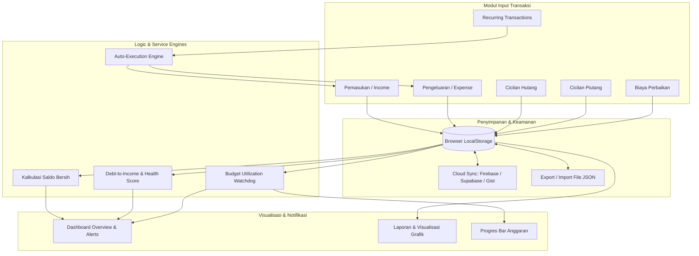

# 🖼️ PreviewApp - Panduan Visual & Arsitektur Logika (v1.2.0)

Dokumen ini berfungsi sebagai pelengkap **[README.md](file:///d:/Website/KeuanganApp/README.md)**. Jika `README.md` merangkum fitur dan cara instalasi, `PreviewApp.md` menyajikan rancangan visual (ASCII UI Mockups), alur kerja pengguna, dan arsitektur logika di balik setiap modul aplikasi **KeuanganApp Web**.

---

## 🏗️ 1) Arsitektur Layout Utama & Global Shell

Aplikasi dirancang dengan antarmuka *dark theme* modern (`#0a0f1a` & `#0c1220`) yang responsif untuk Desktop, Tablet, dan Ponsel pintar (*Mobile Touch/Swipe Gestures*).

```text
┌────────────────────────────────────────────────────────────────────────────────────────┐
│ [💰] KeuanganApp              [Unduhan 📥] [Rabu, 25 Mei 2026 • 11:20 ⏱️] [Keluar 🚪]   │ ← Header Global
├────────────────┬───────────────────────────────────────────────────────────────────────┤
│ 🏠 Beranda      │  (BREADCRUMB): KeuanganApp > Dashboard                                │
│ 📈 Pemasukan    ├───────────────────────────────────────────────────────────────────────┤
│ 📉 Pengeluaran  │                                                                       │
│ 💳 Hutang       │                                                                       │
│ 🪙 Piutang      │                        AREA KONTEN HALAMAN                            │
│ 🧾 Tagihan      │             (Dashboard / Budget / Reports / Modul CRUD)               │
│ 🐷 Budget       │                                                                       │
│ 🔄 Transaksi    │                                                                       │
│ 📊 Laporan      │                                                                       │
│ 🔧 Perbaikan    │                                                                       │
│ 📖 Catatan      │                                                                       │
│ ☁️ Backup Cloud │                                                                       │
│ [◀ Collapse]   │                                                                       │
└────────────────┴───────────────────────────────────────────────────────────────────────┘
  ▲ Desktop Sidebar (Expandable / Collapsible 240px ⇄ 80px)
```

### 📱 Tampilan Navigasi Mobile (*Gesture-Driven*)
- **Mobile Header**: Menu drawer toggle `[☰]`, nama halaman aktif, tombol unduhan cepat `[📥]`, dan jam real-time dinamis.
- **Swipe Gestures**:
  - *Swipe Kanan* dari tepi layar kiri (< 40px) untuk membuka Drawer Sidebar.
  - *Swipe Kiri* untuk menutup Drawer Sidebar dengan animasi *slide-in* halus.
- **Route Guard**: Semua rute dilindungi oleh `ProtectedLayout` yang mengecek status sesi PIN di `sessionStorage`.

---

## 📊 2) Detail Halaman & Logika Modul

---

### 🏠 A. Dashboard (`/`)
Pusat komando finansial untuk melihat ringkasan menyeluruh kesehatan keuangan dalam satu pandangan.

```text
┌────────────────────────────────────────────────────────────────────────────────────────┐
│ 💰 SALDO BERSIH: Rp 14.250.000 (Pemasukan + Piutang Masuk - Pengeluaran - Cicil Hutang)│
├──────────────────────────┬──────────────────────────┬──────────────────────────────────┤
│ 📈 Pemasukan (Bulan Ini) │ 📉 Pengeluaran (Bln Ini) │ 💳 Hutang Aktif : Rp 4.500.000   │
│   Rp 18.500.000          │   Rp 6.200.000           │ 🪙 Piutang Aktif: Rp 2.000.000   │
├──────────────────────────┴──────────────────────────┴──────────────────────────────────┤
│ ⚠️ PERINGATAN ANGGARAN (BUDGET ALERTS):                                                │
│ [!] Kategori "Makanan & Minuman" telah terpakai 88% dari anggaran bulanan!             │
├────────────────────────────────────────────────────────────────────────────────────────┤
│ 🛡️ ANALISIS KESEHATAN HUTANG (DTI RATIO):                                              │
│ Skor: SEHAT (DTI 24.3%) • Rasio beban cicilan aman terhadap total pendapatan bulanan. │
├────────────────────────────────────────────────────────────────────────────────────────┤
│ 📈 GRAFIK TREN KEUANGAN (Recharts Interactive Cashflow)                                │
│ [ Pemasukan (Hijau) ───  vs  Pengeluaran (Merah) ─── ]                                 │
├────────────────────────────────────────────────────┬───────────────────────────────────┤
│ 📅 JATUH TEMPO & TRANSAKSI RUTIN (7 HARI KEDEPAN) │ 📝 CATATAN CEPAT TERBARU          │
│ • 15 Mei: Cicilan Laptop (Hutang) - Rp 750.000     │ • Bayar tagihan internet tgl 20   │
│ • 18 Mei: Tagihan WiFi Indihome - Rp 350.000       │ • Cek piutang Budi                │
└────────────────────────────────────────────────────┴───────────────────────────────────┘
```

#### 🧠 Logika Utama Dashboard:
1. **Kalkulasi Saldo Real-Time**:
   $$\text{Saldo Bersih} = (\text{Pemasukan} + \text{Cicilan Piutang Masuk}) - (\text{Pengeluaran} + \text{Cicilan Hutang Keluar} + \text{Biaya Perbaikan})$$
2. **Debt Health / DTI Engine**: Menghitung rasio beban hutang terhadap pendapatan:
   - `< 30%` : **Sehat** (Hijau)
   - `30% - 50%` : **Perhatian / Waspada** (Kuning)
   - `> 50%` : **Beban Tinggi / Kritis** (Merah)
3. **Budget Watchdog**: Mengagregasi pengeluaran per kategori bulan berjalan dan membandingkannya dengan target batas yang diatur di modul `/budget`.

---

### 📈 B. Pemasukan (`/pemasukan`) & 📉 Pengeluaran (`/pengeluaran`)
Modul pencatatan transaksi kas harian dengan kategori terstruktur dan input terformat.

```text
┌────────────────────────────────────────────────────────────────────────────────────────┐
│ Search: [ 🔍 Cari catatan... ]   Filter Kategori: [ Semua Kategori ▾ ]  Bulan: [ Mei ▾]│
├────────────────────────────────────────────────────────────────────────────────────────┤
│ ┌─ FORM INPUT TRANSAKSI CEPAT ───────────────────────────────────────────────────────┐ │
│ │ Kategori: [ 🍔 Makanan & Minuman ▾ (CategoryPicker) ]   Tanggal: [ 2026-05-25 ]    │ │
│ │ Nominal : [ Rp 45.000 (NumericInput Format Rupiah)  ]   Keterangan: [ Makan siang] │ │
│ │ [ Simpan Transaksi ]                                                               │ │
│ └────────────────────────────────────────────────────────────────────────────────────┘ │
├────────────────────────────────────────────────────────────────────────────────────────┤
│ DAFTAR TRANSAKSI:                                                                      │
│ • 25 Mei 2026 │ 🍔 Makanan & Minuman │ Makan siang nasi padang │ -Rp 45.000 │ [✏️][🗑️]  │
│ • 24 Mei 2026 │ 💼 Gaji Pokok        │ Transfer payroll kantor │ +Rp 8.000.000 │ [✏️][🗑️]│
└────────────────────────────────────────────────────────────────────────────────────────┘
```

#### 🧠 Logika & Fitur:
- **`CategoryPicker` Component**: Memilih kategori dengan representasi icon emoji terintegrasi dan warna yang memudahkan identifikasi visual.
- **`NumericInput` Component**: Format mata uang Rupiah otomatis saat mengetik (`Rp 1.000.000`), mencegah kesalahan input string non-angka.
- **Inline Validation**: Memeriksa kelengkapan nama, kategori, dan nominal positif melalui `useFormValidation`.

---

### 🐷 C. Anggaran Bulanan (`/budget`)
Mengatur dan membatasi pagu pengeluaran per kategori agar tidak terjadi *overspending*.

```text
┌────────────────────────────────────────────────────────────────────────────────────────┐
│ 💰 Ringkasan: Total Budget: Rp 5.000.000 │ Terpakai: Rp 3.250.000 (65%) │ Sisa: Rp 1.750.000│
├────────────────────────────────────────────────────────────────────────────────────────┤
│ 🍔 Makanan & Minuman                                              [✏️ Edit Alokasi]   │
│ Rp 1.760.000 / Rp 2.000.000 (88% - ⚠️ Waspada Mendekati Batas)                         │
│ [████████████████████████████████░░░░] 88% (Bar Kuning)                                │
├────────────────────────────────────────────────────────────────────────────────────────┤
│ 🚗 Transportasi & Bensin                                          [✏️ Edit Alokasi]   │
│ Rp 450.000 / Rp 1.000.000 (45% - ✅ Aman)                                              │
│ [████████████████░░░░░░░░░░░░░░░░░░░░] 45% (Bar Hijau)                                 │
├────────────────────────────────────────────────────────────────────────────────────────┤
│ 🛍️ Belanja & Hiburan                                              [✏️ Edit Alokasi]   │
│ Rp 1.040.000 / Rp 1.000.000 (104% - 🚨 Overbudget!)                                   │
│ [████████████████████████████████████] 104% (Bar Merah Animasi)                        │
└────────────────────────────────────────────────────────────────────────────────────────┘
```

#### 🧠 Logika Modul Budget:
- Tersinkronisasi otomatis dengan transaksi yang dicatat pada modul **Pengeluaran**.
- Alert otomatis disalurkan ke widget Dashboard jika pemakaian `≥ 80%` atau `> 100%`.

---

### 🔄 D. Transaksi Berulang / Recurring (`/recurring`)
Otomatisasi pencatatan tagihan dan pengeluaran berkala tanpa perlu input berulang manual.

```text
┌────────────────────────────────────────────────────────────────────────────────────────┐
│ [ + Tambah Transaksi Rutin ]                                                           │
├────────────────────────────────────────────────────────────────────────────────────────┤
│ 🔁 Gaji Bulanan                 │ Tipe: Pemasukan │ Rp 8.500.000 │ Jadwal: Tiap tgl 25 │
│ Status: Terjadwal               │ Eksekusi Terakhir: 25 Apr 2026 │ [▶️ Eksekusi] [✏️][🗑️]│
├────────────────────────────────────────────────────────────────────────────────────────┤
│ 🔁 Langganan Netflix & Spotify │ Tipe: Pengeluaran│ Rp 235.000   │ Jadwal: Tiap tgl 10 │
│ Status: Auto-Executed           │ Eksekusi Terakhir: 10 Mei 2026 │ [▶️ Eksekusi] [✏️][🗑️]│
└────────────────────────────────────────────────────────────────────────────────────────┘
```

#### 🧠 Logika Auto-Execution:
- **`RecurringTransactionService` Engine**: Bekerja saat aplikasi pertama kali dimuat. Memeriksa tanggal sistem dan frekuensi (*Harian, Mingguan, Bulanan, Tahunan*).
- Jika tanggal jadwal telah tiba atau terlewat dan belum dieksekusi pada periode bersangkutan, sistem secara otomatis menambahkan catatan transaksi ke database kas lokal.
- Pengguna juga dapat menekan tombol `[▶️ Eksekusi]` untuk eksekusi segera kapan saja.

---

### 📊 E. Laporan & Analisis Finansial (`/reports`)
Analisis mendalam mengenai arus kas, alokasi anggaran, dan tren jangka panjang.

```text
┌────────────────────────────────────────────────────────────────────────────────────────┐
│ Periode Laporan: [ Mei 2026 ▾ ]                                                        │
├──────────────────────────┬──────────────────────────┬──────────────────────────────────┤
│ Total Pemasukan          │ Total Pengeluaran        │ Rasio Tabungan (Savings Rate)    │
│ Rp 18.500.000            │ Rp 6.200.000             │ 66.5% (Sangat Baik ⭐)           │
├──────────────────────────┴──────────────────────────┴──────────────────────────────────┤
│ 🥧 DISTRIBUSI PENGELUARAN (Pie Chart)     │ 🏆 TOP 5 PENGELUARAN TERBESAR             │
│ • Makanan: 42% (Rp 2.600.000)             │ 1. Sewa Tempat Tinggal : Rp 2.000.000      │
│ • Tagihan & Utility: 28% (Rp 1.750.000)   │ 2. Belanja Bulanan Supermarket: Rp 950.000 │
│ • Transportasi: 15% (Rp 930.000)          │ 3. Servis Motor Berkala: Rp 450.000        │
│ • Lain-lain: 15% (Rp 920.000)             │ 4. Makan Restoran Keluarga : Rp 380.000    │
├───────────────────────────────────────────┴────────────────────────────────────────────┤
│ 📊 TREN ARUS KAS 6 BULAN TERAKHIR (Bar Chart Perbandingan Historis)                   │
│ [Desember] [Januari] [Februari] [Maret] [April] [Mei]                                  │
└────────────────────────────────────────────────────────────────────────────────────────┘
```

---

### 💳 F. Hutang (`/hutang`) & 🪙 Piutang (`/piutang`)
Manajemen kewajiban hutang dan aset pinjaman pihak ketiga dengan dukungan pembayaran bertahap (cicilan multi-step).

```text
┌────────────────────────────────────────────────────────────────────────────────────────┐
│ Search: [ Cari nama/keterangan... ]   Filter: [ Belum Lunas ▾ ]  Urutkan: [ Tempo Terdekat]│
├────────────────────────────────────────────────────────────────────────────────────────┤
│ 💳 Pinjaman Bank / Cicilan Motor                          [ STATUS: DALAM CICILAN 🟡 ] │
│ Total Pinjaman : Rp 12.000.000     Sudah Dibayar: Rp 8.000.000                         │
│ Sisa Kewajiban : Rp 4.000.000      Jatuh Tempo  : 15 Juni 2026 (21 hari lagi)          │
│ ┌─ KALKULATOR RENCANA PELUNASAN CERDAS ──────────────────────────────────────────────┐ │
│ │ Rekomendasi Cicilan: Rp 1.333.333 / bln (Estimasi Lunas dalam 3 Bulan)             │ │
│ │ Beban terhadap Pemasukan: ~7.2% (Beban Ringan & Terkendali)                        │ │
│ └────────────────────────────────────────────────────────────────────────────────────┘ │
│ [ 💵 Bayar Cicilan ]   [ 📜 Riwayat Cicilan (4) ]   [ 📤 Bagikan Rincian ]   [ ✏️ ] [ 🗑️ ] │
└────────────────────────────────────────────────────────────────────────────────────────┘
```

#### 🧠 Logika Cicilan & Sisa:
- $\text{Sisa Hutang} = \text{Total Pinjaman} - \sum(\text{Riwayat Pembayaran Cicilan})$.
- Status otomatis berubah menjadi `LUNAS` (Hijau) jika $\text{Sisa} \le 0$.
- Status otomatis `OVERDUE` (Merah) jika tanggal hari ini melewati tanggal jatuh tempo dan belum lunas.
- **Tombol Bagikan / Share**: Menghasilkan format teks penagihan/konfirmasi ramah yang dapat disalin ke clipboard atau langsung dikirim via WhatsApp.

---

### 🧾 G. Tagihan Rutin (`/tagihan`) & 🔧 Perbaikan Aset (`/perbaikan`)
- **Tagihan (`/tagihan`)**: Melacak tagihan bulanan berulang (PLN, PDAM, BPJS, Internet). Menyediakan status cepat `Sudah Bayar` / `Belum Bayar` untuk bulan aktif.
- **Perbaikan (`/perbaikan`)**: Khusus mencatat pengeluaran pemeliharaan aset berharga (kendaraan, renovasi rumah, elektronik) agar histori biaya perawatan tidak hilang dalam arus kas umum.

---

### 📖 H. Catatan Finansial (`/catatan`)
Media pencatatan memo, daftar belanja, dan ide keuangan bebas dalam 3 tipe format:
1. **Standar**: Judul dan deskripsi teks bebas multi-paragraf.
2. **List / Checklist**: Baris teks otomatis dikonversi menjadi daftar *bullet point* / to-do item.
3. **Singkat / Quick Memo**: Format ringkas cepat (< 100 karakter).

---

### ☁️ I. Backup, Restore & Multi-Engine Cloud Sync (`/backup`)
Menjamin keamanan data pengguna dengan fleksibilitas offline penuh maupun sinkronisasi cloud pribadi.

```text
┌────────────────────────────────────────────────────────────────────────────────────────┐
│ 💾 CADANGAN LOKAL (OFFLINE JSON)                                                       │
│ [ 📥 Unduh Backup JSON ]               [ 📤 Pulihkan dari File JSON ]                  │
├────────────────────────────────────────────────────────────────────────────────────────┤
│ ☁️ CLOUD SYNC ENGINE PILIHAN (PILIH SALAH SATU ATAU GABUNGAN)                          │
│                                                                                        │
│ 1. 🔥 Firebase Firestore  : Sinkronisasi database cloud realtime multi-perangkat.      │
│ 2. ⚡ Supabase Database   : Backend PostgreSQL cloud dengan token API aman.           │
│ 3. 🐙 GitHub Secret Gist  : Simpan backup otomatis ke Gist pribadi akun GitHub Anda.   │
│                                                                                        │
│ Status Sinkronisasi : [ Terhubung ✅ ] • Sinkronisasi Terakhir: 10 Menit yang lalu     │
│ [ 🔄 Sinkronkan Sekarang ]             [ ⚙️ Atur Kredensial Engine ]                   │
└────────────────────────────────────────────────────────────────────────────────────────┘
```

---

### 🔐 J. Keamanan & Layar Login (`/login`)
- Perlindungan kode PIN / Password aplikasi.
- Seluruh data tersimpan aman di `localStorage` peramban lokal pengguna tanpa pelacakan pihak ketiga (*Zero Tracking, Complete Privacy*).

---

## 🔄 3) Alur Integrasi Data End-to-End



---

## 📅 4) Panduan Rutinitas Penggunaan yang Disarankan

| Frekuensi | Tindakan yang Disarankan |
|---|---|
| **Harian** | • Catat pengeluaran harian & pemasukan baru.<br>• Catat pembayaran cicilan hutang/piutang jika ada transaksi.<br>• Cek transaksi berulang yang baru dieksekusi otomatis. |
| **Mingguan** | • Buka Dashboard untuk mengecek indikator *Budget Alerts* (waspada jika mendekati 80%).<br>• Periksa kalender jatuh tempo hutang/piutang dalam 7 hari ke depan.<br>• Tulis catatan memo atau rencana belanja di modul Catatan. |
| **Bulanan** | • Evaluasi performa finansial di menu Laporan (`/reports`) (Cek *Savings Rate* & *Top 5 Pengeluaran*).<br>• Sesuaikan alokasi batas pagu di menu Budget (`/budget`) untuk bulan baru.<br>• Lakukan ekspor file cadangan JSON lokal atau sinkronkan ke Cloud Backup. |

---

## 🎯 5) Nilai Keunggulan Desain Aplikasi

1. **Privasi & Keamanan Mutlak (*Offline-First*)**: Data Anda adalah milik Anda sepenuhnya. Aplikasi berjalan penuh tanpa bergantung pada server luar, didukung PIN lock.
2. **Kalkulasi & Agregasi Otomatis**: Menghilangkan keharusan kalkulasi manual pada sisa hutang, pagu anggaran, rasio DTI, dan saldo bersih.
3. **Antarmuka Premium & Ergonomis**: Dirancang menggunakan dark-mode elegan, responsif terhadap sentuhan dan gesture swipe mobile, serta visualisasi data interaktif berbasis grafik Recharts.
4. **Fleksibilitas Pencadangan**: Mendukung ekspor-impor JSON instan maupun sinkronisasi cloud modern (Firebase, Supabase, GitHub Gist).

---

_Kembali ke dokumentasi utama project:_ **[README.md](file:///d:/Website/KeuanganApp/README.md)**
